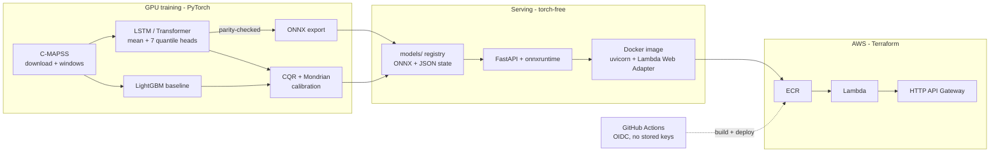

# conformal-rul

[](https://github.com/mateus-aleixo/conformal-rul/actions/workflows/ci.yml)


Probabilistic remaining-useful-life prediction for turbofan engines, with
**distribution-free calibrated intervals** — because in predictive maintenance a
point estimate without a trustworthy error bar invites you to either scrap a
healthy machine or fly a failing one.


PyTorch sequence models trained from scratch on the NASA C-MAPSS benchmark,
wrapped in **conformalized quantile regression** with **Mondrian (per-group)
calibration**, exported to ONNX and served torch-free by a FastAPI service
**running live on AWS Lambda**, provisioned with Terraform and deployed by
OIDC-authenticated GitHub Actions.

**Live demo**: `https://aao1ufi805.execute-api.eu-west-1.amazonaws.com` —
try `GET /health`, `GET /models`, or the `POST /predict` example below.
(Serverless: the first request after idle pays a few seconds of cold start;
the API is deliberately throttled to 5 req/s.)

### One idea, three modalities

This is the first of a series applying the same discipline — *a prediction without a
trustworthy confidence statement is not a decision aid* — to different kinds of data:

| repo | modality | the guarantee |
|---|---|---|
| **conformal-rul** | sensor sequences | RUL intervals with verified coverage, live on AWS Lambda |
| [conformal-seg](https://github.com/mateus-aleixo/conformal-seg) | vision | defect masks bounding the missed-defect rate |
| [conformal-rag](https://github.com/mateus-aleixo/conformal-rag) | language | selective QA that abstains at a calibrated error rate |

Each one is standalone. Read together they make the same argument three times, and
each surfaces a different limit of the method — `conformal-seg` shows a guarantee
holding while the output becomes useless, `conformal-rag` shows a stronger model
making calibration *harder*.

## Results in one table

Test RMSE (cycles) — full tables, NASA scores and coverage analysis in
[docs/results.md](docs/results.md):

| | FD001 | FD002 | FD003 | FD004 |
|---|---|---|---|---|
| LightGBM baseline | **12.12** | **13.96** | **12.27** | 14.89 |
| LSTM | 14.03 | 15.03 | 12.97 | 15.01 |
| Transformer | 13.71 | 14.70 | 13.04 | **14.27** |

Two findings worth your attention:

1. **The boosted-tree baseline wins 3 of 4 subsets.** Deep models only pay
   their way on FD004 (6 operating regimes × 2 fault modes). If your deep
   model beats a weak baseline, check the baseline before the architecture.
2. **90 % intervals really cover ~90 %** (0.87–0.89 empirically, within
   binomial noise of nominal), and Mondrian calibration by predicted-RUL band
   makes them *adaptive*: 11–19 cycles wide when an engine is predicted
   critical vs 36–45 when healthy — tightest exactly where the decision is
   urgent.

## Why conformal, not dropout or ensembles

Split conformal / CQR give **finite-sample marginal coverage guarantees under
exchangeability** — no Gaussian assumptions, no sampling at inference, one
extra vector of calibration scores. Marginal coverage can still hide per-group
under-coverage, which is what the Mondrian layer (per operating regime, per
predicted-RUL band) surfaces and fixes. Method details in
[`src/conformal_rul/conformal.py`](src/conformal_rul/conformal.py) — including
the finite-sample quantile correction and the small-group fallback.

## Quickstart

```bash
git clone https://github.com/mateus-aleixo/conformal-rul && cd conformal-rul

# serve the committed model registry (no GPU, no torch)
docker compose up --build
curl localhost:8000/health

# or retrain everything from scratch (~5 min on a laptop RTX 3060)
pip install -e .[train,dev]
python -m conformal_rul.data
python -m conformal_rul.train --all
python -m conformal_rul.conformal && python -m conformal_rul.export
```

### One request

```bash
curl -X POST localhost:8000/predict -H "Content-Type: application/json" \
  -d '{"subset":"FD001","coverage":90,"cycles":[{"setting_1":-0.0007,
  "setting_2":-0.0004,"setting_3":100.0,"s_01":518.67,"s_02":641.82,
  "s_03":1589.7,"s_04":1400.6,"s_05":14.62,"s_06":21.61,"s_07":554.36,
  "s_08":2388.06,"s_09":9046.19,"s_10":1.3,"s_11":47.47,"s_12":521.66,
  "s_13":2388.02,"s_14":8138.62,"s_15":8.4195,"s_16":0.03,"s_17":392.0,
  "s_18":2388.0,"s_19":100.0,"s_20":39.06,"s_21":23.419}]}'
```

```json
{"rul_cycles": 118.9, "interval": {"lower": 87.5, "upper": 125.0, "coverage": 90},
 "risk_band": "healthy", "operating_regime": 0, "subset": "FD001",
 "model": "transformer", "n_cycles_used": 1, "padded": true}
```

Interactive docs at `localhost:8000/docs`.

## Architecture



More in [docs/architecture.md](docs/architecture.md) ·
deployment runbook in [docs/deploy.md](docs/deploy.md) ·
[model card](docs/model-card.md).

## Design decisions

- **Splits are by engine unit, never by window** — sliding windows from one
  engine are near-duplicates; window-level splits leak and flatter every metric.
- **Preprocessing and conformal state serialize to JSON** — serving needs
  neither pickle nor scikit-learn nor torch; the 359 MB image cold-starts in
  seconds.
- **One container for laptop and Lambda** via the Lambda Web Adapter — no
  Lambda-specific code path to drift from local behavior.
- **The deploy role can ship code, not change infrastructure** — OIDC-scoped
  to this repo's main branch and tags; ECR push + `UpdateFunctionCode` only.
- **Honest numbers over leaderboard numbers** — fixed seed, default-ish
  hyperparameters, the baseline reported where it wins.

## Limitations

Simulated data, per-subset models, approximate exchangeability at the
benchmark's censored last windows — spelled out in the
[model card](docs/model-card.md). Not a certified maintenance tool.

## License

MIT © Mateus Aleixo
