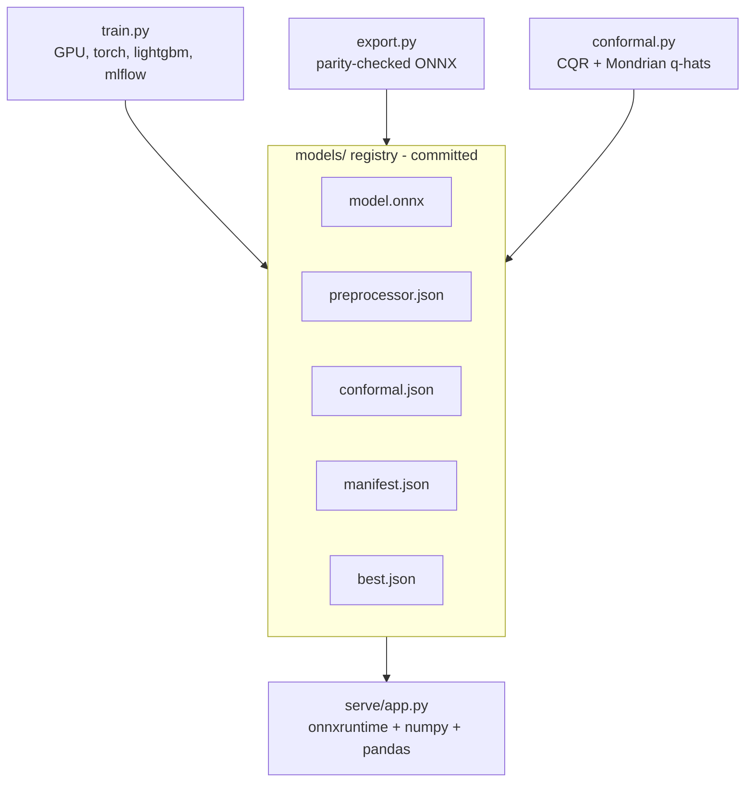
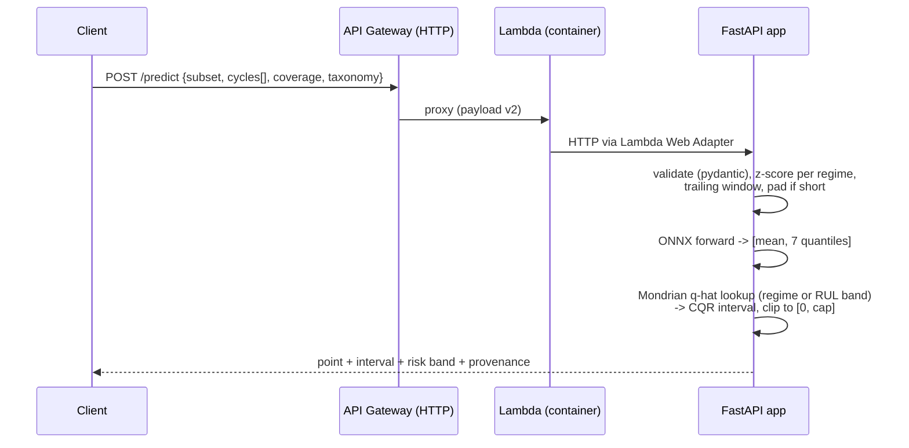
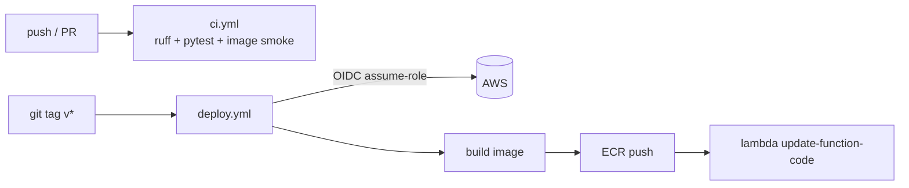

# Architecture

## The boundary that matters: training vs serving

The repository is split along one line: everything that needs PyTorch,
LightGBM, scikit-learn or a GPU happens at training time and writes plain
artifacts; serving reads those artifacts with onnxruntime and numpy only.

Three artifact rules make this clean:

1. **No pickle anywhere.** The preprocessor (regime centers, normalization
   stats, sensor selection) and the conformal state (per-group q̂ values)
   round-trip through JSON. The serving image can't deserialize arbitrary
   code, and artifacts stay diffable in review.
2. **ONNX is the only model format serving knows.** Exports are accepted only
   after a parity check against the torch forward pass (max |Δ| ≤ 1e-4).
   Quantile monotonization (sorting columns 1..7) is re-applied at serving
   time, identical to training.
3. **`best.json` is the deployment pointer.** Model selection (lowest test
   RMSE among the sequence models) is an artifact, not a config constant —
   retraining can change the served architecture without touching code.

## Request path

Cold start ≈ container boot + one ONNX session per requested subset (lazy,
`lru_cache`). The Web Adapter means the same image runs `docker compose up`
locally — there is no Lambda-only code path to drift.

## Data pipeline invariants

- **Unit-level splits** (train/val/cal 70/15/15 by engine, seeded). Windows
  from one engine never straddle a split boundary.
- **Calibration exclusivity**: the cal split feeds only the conformal layer;
  normalization and early stopping never see it.
- **Regime-conditional normalization**: 6 operating regimes (FD002/FD004) are
  found by KMeans on standardized settings at fit time; at transform time
  regime assignment is nearest-center in numpy — serving carries the centers,
  not scikit-learn.
- **Variance-rule sensor selection** per subset (15–17 of 21 kept) instead of
  a hardcoded literature list — the rule travels with the preprocessor.

## CI/CD

- CI never installs torch: the test suite runs against the committed registry.
- The deploy job authenticates by OIDC federation (no stored keys) into a role
  that can push to one ECR repo and update one function — infrastructure
  changes remain a local, reviewed `terraform apply` (see
  [deploy.md](deploy.md)).
