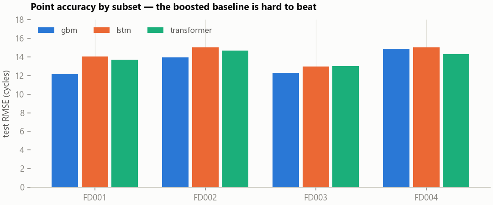
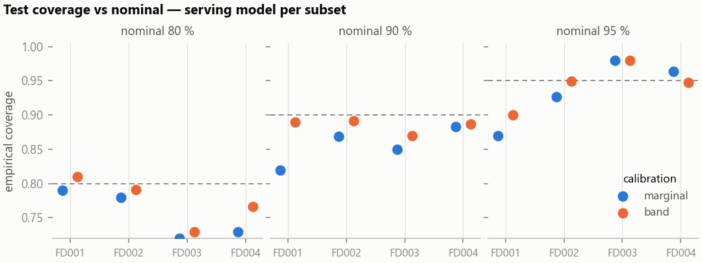
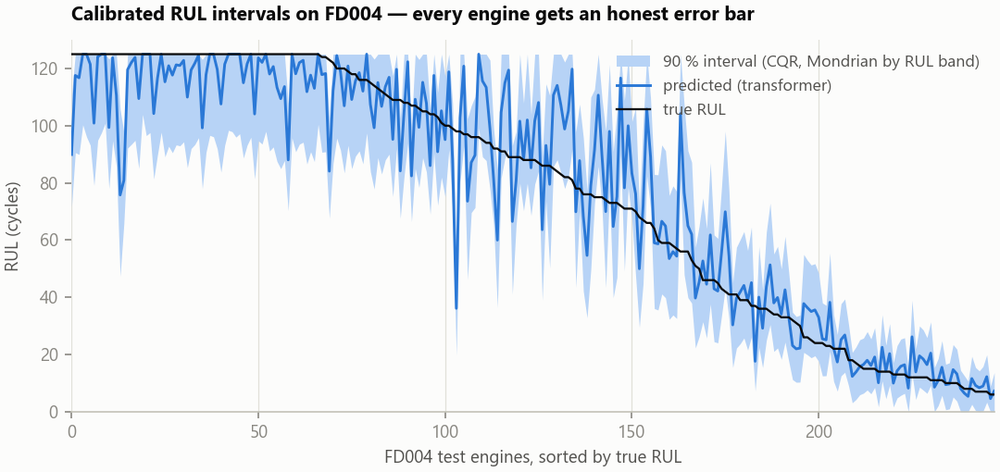

# Results

All numbers are from the committed run manifests (`models/*/*/manifest.json`)
and coverage reports: reproduce with the commands at the bottom. Evaluation
follows the standard C-MAPSS protocol: one prediction per test engine at its
last observed cycle, truth from the `RUL_FD00x.txt` files, targets capped at
125 cycles. Splits are by engine unit; the calibration split touches nothing
but the conformal layer.

## Point accuracy

Test RMSE (cycles) / NASA PHM08 score (lower is better; the score punishes
*late* predictions exponentially harder than early ones):

| Subset | LightGBM | LSTM | Transformer | Served |
|---|---|---|---|---|
| FD001 | **12.12** / 231 | 14.03 / 323 | 13.71 / 286 | transformer |
| FD002 | **13.96** / 960 | 15.03 / 1205 | 14.70 / 997 | transformer |
| FD003 | **12.27** / 261 | 12.97 / 275 | 13.04 / 409 | lstm |
| FD004 | 14.89 / 1058 | 15.01 / 1334 | **14.27** / 1019 | transformer |

Context from published work on the same protocol: DCNN (Li, Ding & Sun 2018)
reports 12.61 / 22.36 / 12.64 / 23.31 RMSE on FD001–FD004; early deep-LSTM
work (Zheng et al. 2017) 16.14 / 24.49 / 16.18 / 28.17. Recent specialized
architectures push FD001 toward ~10–12. These runs use default-ish
hyperparameters, a fixed seed and early stopping (no benchmark tuning) and
still sit in the credible band, with FD002/FD004 clearly better than the
older published baselines.

**The honest finding: the boosted-tree baseline wins 3 of 4 subsets.** With
window summary statistics (mean/std/last/slope per sensor) and the
last-window protocol, LightGBM is simply hard to beat on the smaller,
single-regime subsets. The sequence models only pay their way on FD004:
six operating regimes × two fault modes, the setting with the most temporal
structure to exploit. If your tabular baseline loses to your deep model by
default, check the baseline.



## Interval calibration

90 % target, serving model per subset, on test engines. `marginal` is one
global correction; `band` is Mondrian calibration per predicted-RUL band
(critical < 30 < warning < 80 < healthy):

| Subset | Marginal cov. | Marginal width | Band cov. | Band width |
|---|---|---|---|---|
| FD001 | 0.820 | 38.1 | 0.890 | 36.8 |
| FD002 | 0.869 | 42.4 | 0.892 | 39.9 |
| FD003 | 0.850 | 31.5 | 0.870 | 33.1 |
| FD004 | 0.883 | 37.9 | 0.887 | 34.2 |

Mondrian-by-band moves every subset closer to nominal **and** narrows the
average interval: adaptivity is not a coverage trade-off here. With 100–259
test engines per subset the binomial noise on an empirical coverage is
roughly ±0.02–0.03, which brackets the residual gap. There is also a real
protocol shift working against the guarantee: calibration windows are drawn
along whole run-to-failure trajectories while test windows are each engine's
last observation, so exchangeability holds only approximately: reported
as-is rather than patched.

Width by predicted band (90 %, serving models) is where the practical value
shows: the interval is tightest exactly where the decision is urgent:

| Subset | Critical (<30) | Warning (30–80) | Healthy (>80) |
|---|---|---|---|
| FD001 | 17.5 | 40.7 | 44.8 |
| FD002 | 17.2 | 49.7 | 46.1 |
| FD003 | 11.4 | 36.1 | 40.2 |
| FD004 | 19.0 | 44.1 | 35.7 |





## Reproduce

```bash
pip install -e .[train]
python -m conformal_rul.data            # download C-MAPSS
python -m conformal_rul.train --all     # 12 runs; ~5 min on an RTX 3060
python -m conformal_rul.conformal       # calibrate + coverage reports
python -m conformal_rul.export          # ONNX + serving selection
python scripts/make_figures.py
```
